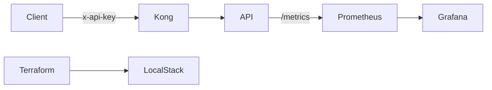

Zama DevOps/SRE Challenge
=========================

Minimal Node/TypeScript API behind Kong with metrics, Docker, Terraform (LocalStack), and CI.

Run locally
-----------
Prereqs: Docker, Docker Compose, Node 20+, Terraform 1.8+.

```bash
localstack start -d
```

```bash
aws s3 mb --endpoint http://localhost:4566 --region eu-west-3 s3://zama-terragrunt-state
```

```bash
k3d registry create zama-local-k3d-registry --port 49810 && \
k3d cluster create --k3s-arg "--disable=traefik@server:*" --image rancher/k3s:v1.33.4-k3s1 --registry-use zama-local-k3d-registry:49810 --port "80:80@loadbalancer" --port "443:443@loadbalancer" zama-local-k3d && \
k3d kubeconfig get zama-local-k3d > ~/.kube/kubeconfig-zama-local-k3d.yaml
kubectl -n zama-internal-api apply -f https://raw.githubusercontent.com/Kong/charts/main/charts/kong/crds/custom-resource-definitions.yaml # TODO: remove this once we have a proper CRD
```

```bash
echo "127.0.0.1 k3d-zama-local-k3d-registry" | sudo tee -a /etc/hosts
```

```bash
docker build -t k3d-zama-local-k3d-registry:49810/zama-internal-api:local .
docker push k3d-zama-local-k3d-registry:49810/zama-internal-api:local
```

```bash
cd infra/terraform
export AWS_ENDPOINT_URL=http://localhost:4566 # this necessary temporarily for terragrunt to work, or else we have a 403 error on s3 remote state
```

```bash
terragrunt init --all
```

```bash
terragrunt --non-interactive apply --all
```

```bash
terragrunt output --working-dir local/aws/eu-west-3/internal/services/kube-prometheus-stack grafana_admin_user
terragrunt output --working-dir local/aws/eu-west-3/internal/services/kube-prometheus-stack grafana_admin_password
terragrunt output --working-dir local/aws/eu-west-3/internal/services/zama-internal-api api_key
```

```bash
curl -s http://api.internal.localhost/healthz
curl -sS -X POST 'http://api.internal.localhost/hash' -H 'Content-Type: application/json' -H 'x-api-key: REPLACE_ME' -d '{"value":"hello"}'
```

Terragrunt (LocalStack)
-----------------------
```bash
## Generate and save a plan (text) and graph (.dot and .png)
cd infra/terraform/local/aws/eu-west-3/internal/services/zama-internal-api
terragrunt plan -out=tfplan.binary
ROOT=$(git rev-parse --show-toplevel)
terraform show -no-color tfplan.binary > "$ROOT/infra/terraform/plan.txt"
terraform graph > "$ROOT/infra/terraform/graph.dot"
command -v dot >/dev/null 2>&1 && dot -Tpng "$ROOT/infra/terraform/graph.dot" -o "$ROOT/infra/terraform/graph.png" || echo "Install Graphviz 'dot' to render PNG"
```

Saved outputs to commit (example paths):
- `infra/terraform/plan.txt`
- `infra/terraform/graph.dot` (and/or `infra/terraform/graph.png` if Graphviz is installed)

Observability
-------------
- Prometheus at http://localhost:9090
- Grafana at http://localhost:3001 (admin/admin)

Diagram
-------


Notes
-----
- `/hash` requires `x-api-key` via Kong; health endpoints are public.
- CI runs tests, build, docker, and terraform plan; artifacts: `infra/terraform/plan.txt`, `infra/terraform/graph.dot`.


